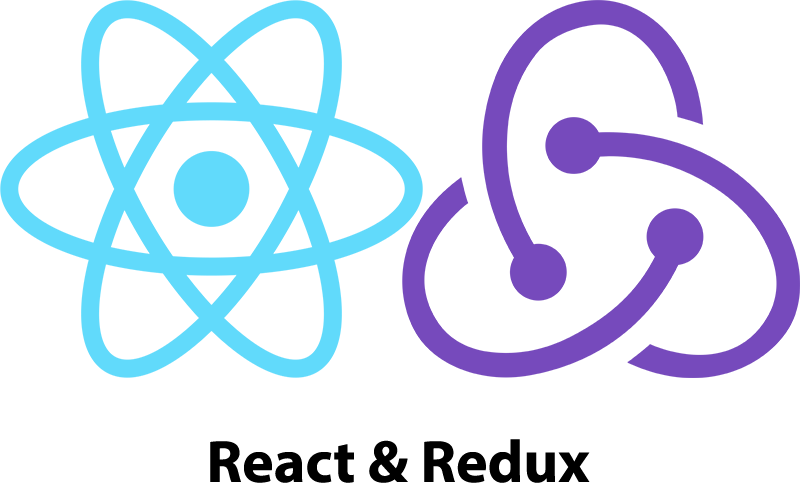
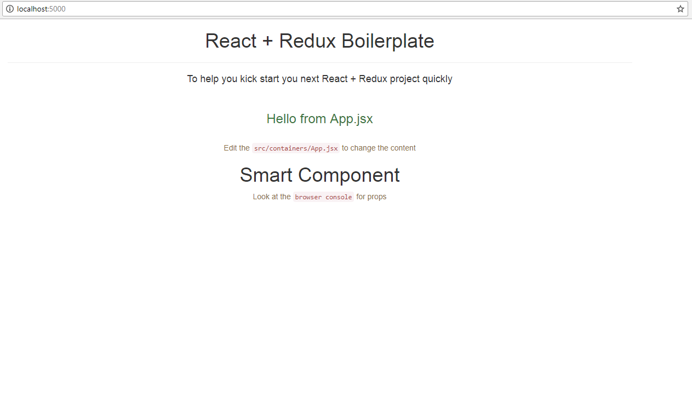

# React + Redux Starter Kit

To help you kick start your  next react-redux project in no time. 
<hr>

#### Still under making and getting lot of updates and changes. Please look at the changelog for latest changes

### Change Log
Change logs can be seen [here](./CHANGELOG.md)

--------------------------------


<hr>

## Features 

* Hot Module Reload
* Pretty easy to get up and running
* Simple webpack config ([See here](./webpack.config.js))

### Setup and Run

* Clone this repo
* Type ```npm run clean-commits``` // to start with a fresh git repo 
* Type ```npm install```
* Type ```npm run dev```
* In the browser,  type ```localhost:5000```

## TODO:
* #### Packages Included
* #### Miscs
* #### Config Info
* #### Tools Used

### Screens


